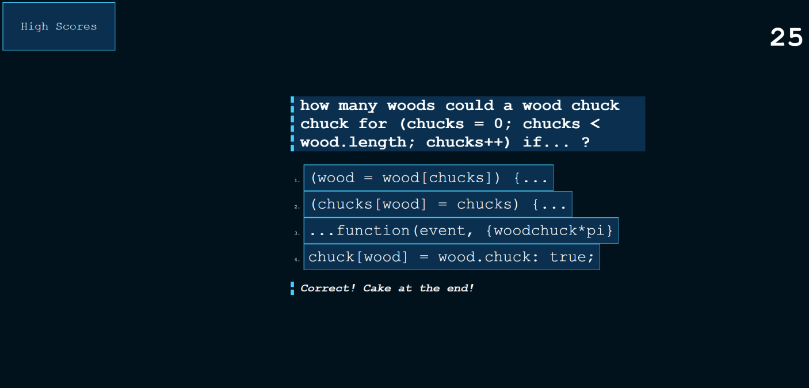

# JS-timed-quiz

## Description

This is my second iteration of using JavaScript logic. This application was created by myself from scratch. [Here is a link to the application](https://theashrose.github.io/JS-timed-quiz/)
I practiced using web APIs to execute the following for this quiz:
--Show and hide the page depending on where the user needs to interact. 
--Run a timer - which reduces by 15 seconds for every missed question and ends the quiz if time runs out.
--Display wether or not the user selected the correct answer - as well as keep track of their score.
--Take the user's initials at the end and compile it with their score on a score sheet - which the user may clear if they wish.

I am proud of this project as it took a lot of energy to learn how to implement the technologies used. Even the CSS - the positioning of every element on the page - demonstrates knowledge I have learned practicing web development thus far.

## How to use

Simply click the start button and follow the prompts! Easy to use and difficult to master ;)

## Screenshot of app



## the Code!
Here I am showing the conditionals placed on the questions to verify if it was correct or not. This was the most important piece as it:
--Populates the next question
--Increases score OR reduces time
--Sends a message to the user if their answer was right or wrong

```
var answerButtonAll = document.querySelectorAll(".answerButton");
    for (x = 0; x <answerButtonAll.length; x++){
        answerButtonAll[x].addEventListener("click", function(event){
             if (event.target.innerText !== questionArray[questionIndex].correctAnswer) {
                timeLeft = timeLeft - 15;
                answerStatus.textContent = "WRONG ANSWER! NO SOUP FOR YOU!";
             }
             if (event.target.innerText == questionArray[questionIndex].correctAnswer) {
                userScore = userScore +3;
                answerStatus.textContent = "Correct! Cake at the end!";
             }
            questionIndex++
            populateQuestion()
        });
    }

```

## Author Links
---[Linkedin](https://www.linkedin.com/in/ashlynn-conradson-76638b172/)---
[GitHub](https://github.com/theashrose/)---
[Portfolio](https://theashrose.github.io/ashlynn-Conradson-Portfolio/)---